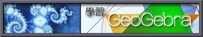

# Geogbra URL

- 

https://sites.google.com/a/ymsh.tp.edu.tw/geogebra/

這是一本 GeoGebra 的[入門書](http://www.wunan.com.tw/bookdetail.asp?no=11568)：「GeoGebra - 幾何與代數的美麗邂逅」，歡迎想要進一步瞭解這個好用又免費的軟體的讀者們採用。

出版：2013/06/03

作者：羅驥韡

- GeoGebra基础教程免费

https://ke.qq.com/course/134786?taid=595866582912642

https://study.163.com/course/introduction.htm?courseId=1002948008#/courseDetail?tab=1

https://www.bilibili.com/video/av77119358

- Geogbra 论坛

  http://www.jiaoshiqun.cn/ggb/

  http://jiaoshiqun.cn/2046

  

