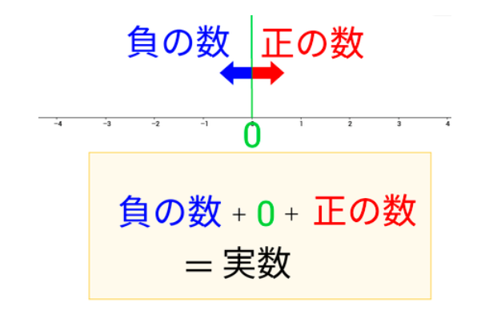
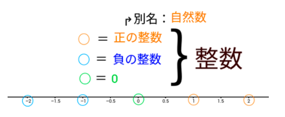

# 自然数 ,整数,正数、実数

## 数直線

https://www.studyplus.jp/346

自然数とは、正の整数である。(1以上の整数)

となります。
ですが、「正」や「整数」という数学用語を知らなければ自然数がなんなのか分かりません。

それぞれの言葉での定義は、
「正」の数とは、0よりも大きな数。(小数や分数を含む。)
「負」の数とは、0よりも小さな数。(小数や分数を含む。)
「整数」とは、0、及び0に1を次々に足したり引いたりして得られる数。(小数や分数は含まない。)
となっていますが、言葉の説明ではしっくりこない人もいると思います。

言葉で見てわかりにくい時は、具体例や図で考えると理解しやすくなります。